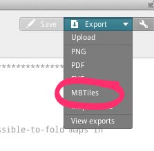
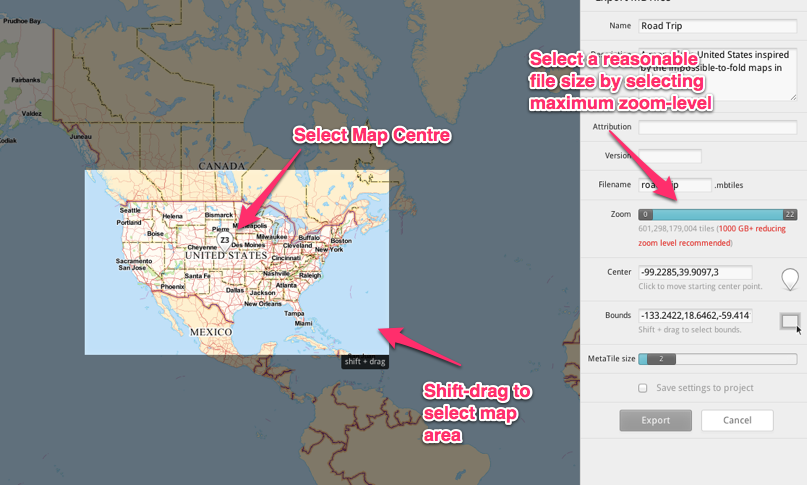
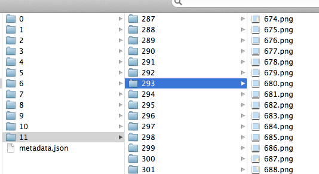
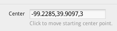
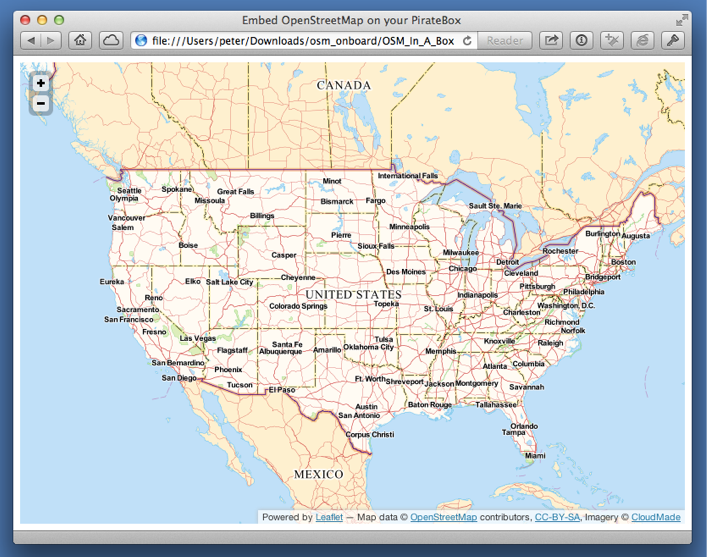

PirateBox + OpenStreetMap
=========================

This is an attempt to ease the process of creating a static [OpenStreetMap](http://www.openstreetmap.org/) map using [Leaflet](http://leafletjs.com/) suitable for running on a standalone [PirateBox](http://wiki.daviddarts.com/PirateBox_DIY).

I build upon this [PirateBox forum thread](http://forum.daviddarts.com/read.php?2,6988) and the work of [@RatZillaS](http://twitter.com/RatZillaS) to [knit all this together](http://ratzillas.com/osm/osm_onboard.zip).

Generating Tiles
----------------

I used [TileMill](http://www.mapbox.com/tilemill/) to generate the map tiles I wanted to serve in the MBTiles format.

I found [this tutorial for using OpenStreetMap data with TileMill](http://www.mapbox.com/tilemill/docs/guides/osm-bright-mac-quickstart/) to be particularly useful for creating custom tiles, but to start I just used data already in TileMill: I created and style the kind of map I wanted in TileMill, and then selected **Export | MBTiles**:

On the export settings screen you need to do three things:

1. Select the area of the map you want to export (using shift+drag to select).
2. Select the centre of the map (a single click on the map).
3. Select the maximum zoom level using the slide on the left; this will determine the size of your export (displayed as you slide).

Click **Export** and the result should be a ``.mbtiles`` file, in my example ``road-trip.mbtiles``.

Converting Tiles
----------------

Next you need to convert the tiles into a format that Leaflet can use.

Grab the [mbutil utility from GitHub](https://github.com/mapbox/mbutil)

	git clone git://github.com/mapbox/mbutil.git
	cd mbutil
	mb-util road-trip.mbtiles tiles

The result will be a directory called ``tiles`` with subdirectories for each zoomlevel and subdirectories under that which, in turn, contain tiles:

Readying the Code
-----------------

From GitHub grab the basic template in the **www** directory of this repository:

	git clone https://github.com/reinvented/openstreetbox.git
	cd openstreetbox/www
	
Replace the ``tiles`` directory under ``openstreetbox/www`` with the ``tiles`` directory you created in TileMill.

Next, edit the ``index.html`` file, and change the centre of the map to match the centre you set in TileMill, reversing the latitude and longitude and setting the zoomlevel (11 in the example below) to the maximum zoomlevel you set in TileMill:

into:

	var map = L.map('map').setView([39.9097,-99.2285], 11);
	
Finally, set the maxZoom and minZoom to the maximum and minimum zoom levels to match TileMill:
	
			maxZoom: 12,
			minZoom: 4,
	
Taking a Look
-------------

Finally, load the ``index.html`` in a browser:

Installing on PirateBox
-----------------------

The easiest way to get the map onto your PirateBox is to insert the PirateBox USB stick into your computer and copy the contents of ``osm_onboard`` into the ``PirateBox/Shared`` directory, perhaps inside a ``maps`` subdirectory (depending on your machine and the number of tiles generated, this may take a while; for me it took 30 minutes).

Finally, replace the USB stick into your PirateBox, power it up, and navigate to the "Browse" 